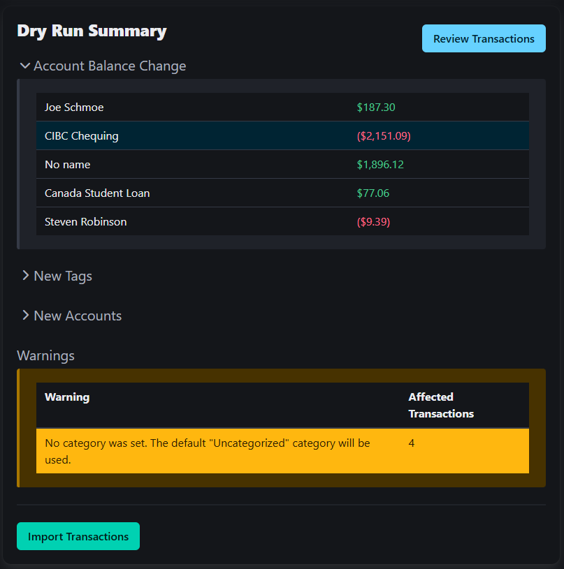

# Midas

A budgeting app built around the idea of using Node-Red to parse csv files.

## About

I've been using [Firefly-III](https://github.com/firefly-iii/firefly-iii) for a couple of years now, and as much as I like it, I found the rule system for automatically updating transactions to be somewhat limiting. Just adding regular expressions would have made it so much stronger. I built [Firefly-III Postprocessor](https://github.com/haondt/firefly-iii-pp) to solve this, which essentially executes rules built in [Node-Red](https://nodered.org/). Midas takes this idea to its logical conclusion, combining the two into a standalone application.

Firefly-III also has a [standalone companion app](https://github.com/firefly-iii/data-importer) for importing data. I don't see why such a utility should be seperate, so Midas has this feature directly integrated.

## Features

### Node-Red

The Node-Red flow includes a number of "Midas" nodes, which help with connecting to the Midas application. The flow is used to parse csv rows and determine account information, categories, tags, etc.

    
    
<i>Node-Red flow</i>

### Transaction Import

Take in a csv file, set some configuration options and run each row of the csv through the Node-Red flow. Preview the changes (new accounts, changed balances, new tags, warnings, errors, etc) before running the import.

    

        

            
            
<i>Transaction Import</i>

        

        

            
            
<i>Import Dry Run Result</i>

        

    

