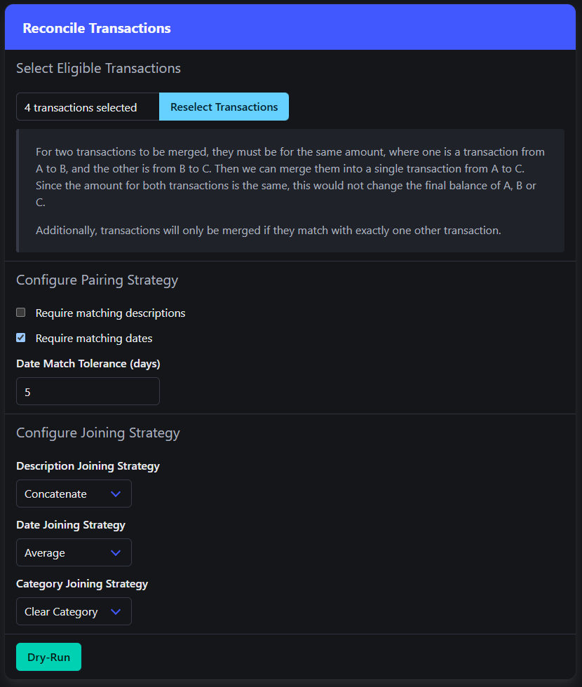

# Midas

A budgeting app built around the idea of using Node-Red to parse csv files.


## About


### Firefly III and the Post-Processor

I've been using [Firefly III](https://github.com/firefly-iii/firefly-iii) for a couple of years now, and as much as I like it, I found the rule system for automatically updating transactions to be somewhat limiting. Regular expressions and nested conditionals are must-haves for me. I built [Firefly III PP](https://github.com/haondt/firefly-iii-pp) to solve this, which essentially executes rules built in [Node-Red](https://nodered.org/). Midas takes this idea to its logical conclusion, combining the two into a standalone application.

Firefly III also has a [companion app](https://github.com/firefly-iii/data-importer) for importing data. I don't see why such a utility should be seperate, so Midas has this feature directly integrated.

### Budgeting Philosophy

My budgeting philosophy is very simple. Minimize your needs, maximize your income, save a fixed amount and spend what's left. Under this pretense budgeting becomes a three step process.

1. Do everything you can to reduce spending on "needs" as much as possible. At the same time, do everything you can to grow your income.
2. After a couple months of this, take your income minus your needs to see what you have to work with. Slice out a piece of that (% or $ amount) and consider it saved.
3. What's left can be spent freely.

Midas is built to enable this kind of budgeting. Categorization and report generation allows you to determine where money is going for steps 1 and 2. For step 3 all you have to do is open the app and check your total income minus your total spending ("Cash Flow" on the dashboard). If this amount is greater than your savings goal, you can spend more. If this amount is less than your savings goal, you are spending too much.

### Flexibility

Midas (currently) does not allow you to set hard numbers for savings goals, budgets or spending limits. This is because, at the end of the day, things change. My paychecks aren't always the same amount, my bills aren't always the same amount, sometimes I have a sudden expense or a sudden injection of cash. All I really care about is that my net worth is trending upwards, ideally at the rate of at least 1x my savings goal / period. So most of the metrics in Midas are based around balance deltas rather than actual amounts.

## Features

### Node-Red

The Node-Red flow includes a number of "Midas" nodes, which help with connecting to the Midas application. The flow is used to parse csv rows and determine account information, categories, tags, etc.

<div align="center">
    
</div>


### Transaction Import

Take in a csv file, set some configuration options and run each row of the csv through the Node-Red flow. Preview the changes (new accounts, changed balances, new tags, warnings, errors, etc) before running the import.

<div align="center">
    
</div>

### Transaction Reconciliation

Given two transactions, one from A -> B and another from B -> C, we can merge them into a single transaction from A -> C without changing the balances of A, B or C. This comes in handy when I need to import two sides of a transfer between accounts seperately, and then reconcile them later.

<div align="center">
    
</div>

### Key-Value Store

A large component of the Node-Red flow winds up being an alias-key-value lookup. For example,

```
 alias WLMRT -> key Walmart
 alias WALMART -> key Walmart
 alias Walmart -> key Walmart

 key Walmart -> (name Walmart, category Groceries)
 ```

 So the key-value store provides exaclty this, a simple mapping from string aliases to string keys to string values. There is an accompanying API that the Node-Red flow can hook into to perform lookups.

<div align="center">
    
</div>

### Reporting

Generate reports for a given period, summarizing the income and spending across categories for the duration of that period.

<div align="center">
    
</div>


### Other Features

- Reporting
  - Dashboard - a summarized report for a given period
  - Categorization - all transactions belong to a single category, and may have any number of tags. Categories themselves belong to a single supercategory.
- Transactions
  - Search - search, filter and sort transactions
  - Merge - combine any two or more existing transactions into a single one
  - Split - split a transaction into two or more new ones
  - Create - manually create transactions
  - Edit - manually edit transactions
  - Re-Import - re-run the Node-Red flows on existing transactions, instead of deleting them and re-importing the csv
- Accounts
  - Create - manually create accounts
  - Edit - manually edit accounts, and mark or unmark them as belonging to you
- Automation
  - Node-RED - send test requests directly to Node-RED and view the response
  - Node-RED Editor - edit the flows directly in Midas using an embedded editor
- Administration
  - Data import/export - import or export data
  - Data deletion - mass delete data

## Documentation

Coming Soon!

## Deployment

### Deploy with Docker

- Spin up an instance using [`docker-compose.yml`](./docker-compose.yml)
- I would recommend using the `midas` subflows in the [`flows.json`](./node-red/data/flows.json) inside this repo. It will give you at least a good starting point for configuring your flow to play nice with Midas.

### Deploy for development

- Start [`docker-compose.dev.yml`](./docker-compose.dev.yml) to start the node red flow.
  - Navigate to http://localhost:1880
- Open the project in Visual Studio and run with `http` launch settings, or using the `dotnet` CLI.
  - In the latter case, I prefer using the following command to allow the Node-Red flows to access it from Docker in WSL: `dotnet watch --project .\Midas\Midas.csproj --no-hot-reload --urls http://0.0.0.0:5190`.
  - Navigate to http://localhost:5190

## Tech Stack

- The application is mostly built with C# (.NET 8).
- The UI is done with [Blazor Static Server-Side Rendering](https://learn.microsoft.com/en-us/aspnet/core/blazor/?view=aspnetcore-9.0). [htmx](https://htmx.org/) provides interactivity.
- Client-side scripting is done with [hyperscript](https://hyperscript.org/).
- Charts are built with [Chart.js](https://www.chartjs.org/docs/latest/).
- Styling is provided by [Bulma](https://bulma.io/).
- Currently the only option for data persistence is [Sqlite](https://www.sqlite.org/).
- File import processing is done with [Node-Red](https://nodered.org/)